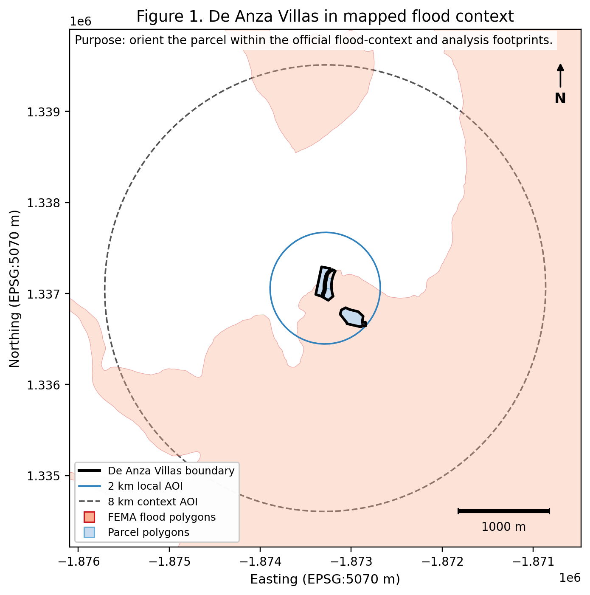
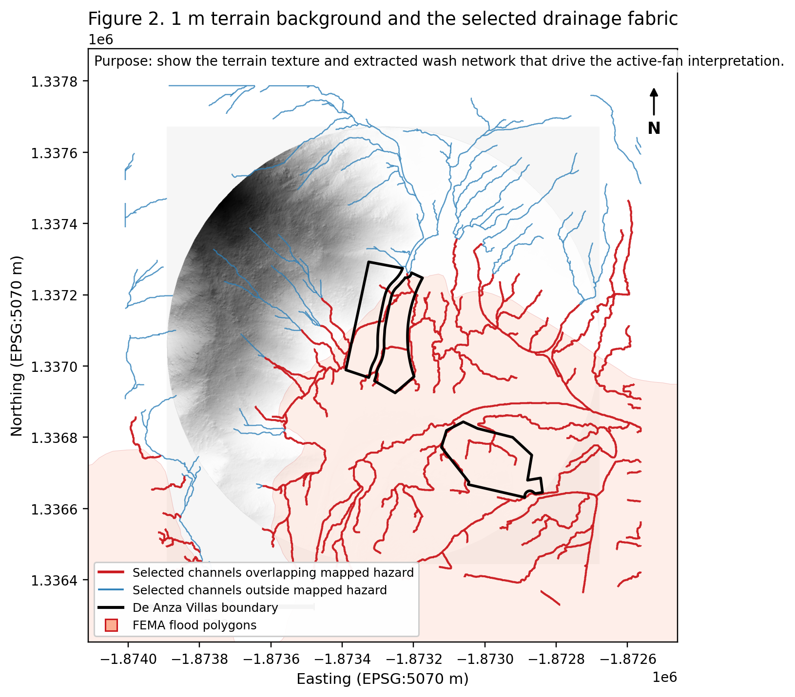
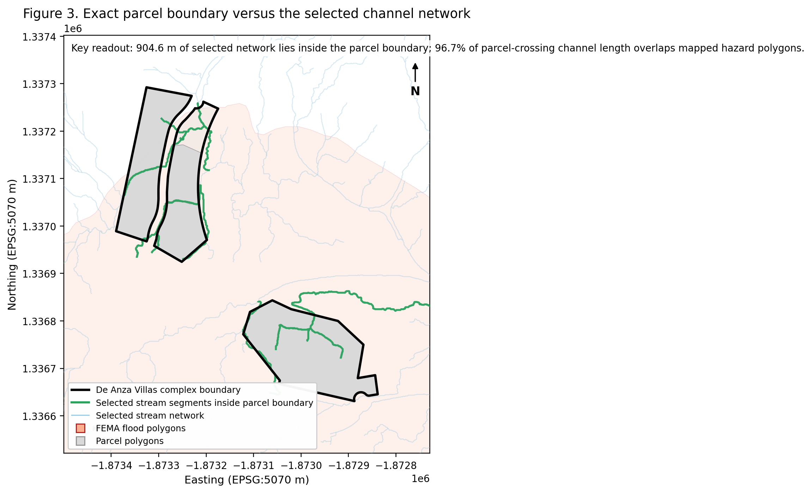
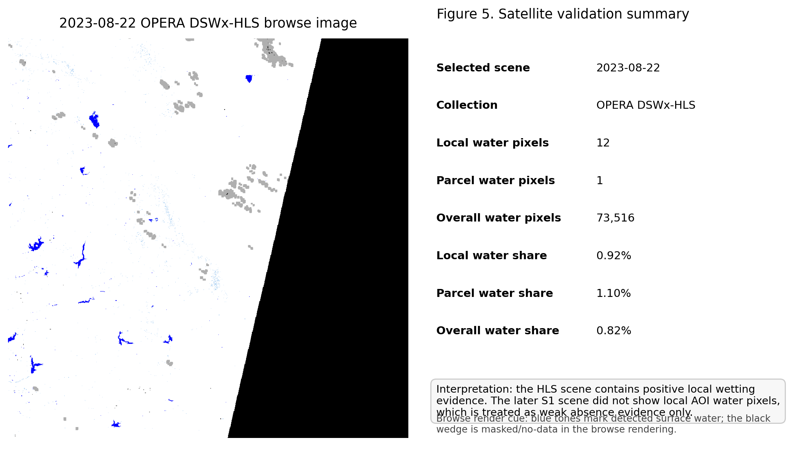

---
format:
  html:
    embed-resources: true
    self-contained: true
    toc: true
    toc-depth: 2
    toc-location: right
    number-sections: false
    page-layout: full
    fig-cap-location: bottom
    title-block-banner: false
    css: styles.css
    include-in-header:
      - text: |
          <link rel="preconnect" href="https://fonts.googleapis.com">
          <link href="https://fonts.googleapis.com/css2?family=Inter:wght@400;500;600;700&family=Merriweather:ital,wght@0,400;0,700;1,400&display=swap" rel="stylesheet">
jupyter: deanza-study
execute:
  echo: false
  warning: false
---

```{python}
#| echo: false
import pandas as pd
import plotly.graph_objects as go
import plotly.express as px
from pathlib import Path

ROOT = Path("/home/hermes/workspace/deanza-villas-flood-study")

# Load threshold sweep data
sweep = pd.read_csv(ROOT / "data/processed/terrain/deanza_villas_2km_1m/channels/deanza_villas_2km_1m_dem_filled_stream_threshold_sweep.csv")
fan = pd.read_csv(ROOT / "data/processed/terrain/deanza_villas_2km_1m/fan_synthesis/fan_synthesis_stats.csv")
```

::: {.hero}
# De Anza Villas Flood Study
### Borrego Springs, California — May 2026

<div class="hero-divider"></div>

**A private due-diligence flood-risk synthesis** using public lidar terrain data, FEMA flood mapping, and satellite surface-water observations to assess parcel-scale exposure on an active alluvial fan.
:::

## Executive Summary

De Anza Villas is **materially exposed** to active concentrated-flow / alluvial-fan flood hazard on the Borrego Springs valley floor. That conclusion is supported by five independent lines of evidence that all point in the same direction:

1. Official flood-context mapping places the parcel in FEMA Zone AO with depth and velocity hazards
2. A 1-meter terrain reconstruction reveals an active drainage texture, not a flat uniform surface
3. Exact parcel overlay shows the extracted drainage network intersects the property directly — 96.7% of parcel-crossing channel length overlaps mapped hazard
4. Fan-activity synthesis confirms the parcel sits on geomorphically active alluvial fan (DRI 2015: ~90% of the Borrego Springs study area)
5. Satellite validation provides positive wetting evidence from an OPERA DSWx-HLS scene (2023-08-22)

This report stays strictly within the evidence produced by the completed workflow. It does not invent calibrated flood depths, regulatory determinations, or new hydrodynamic model results.

::: {.callout-note appearance="simple"}
### What this report is — and isn't

**This is** a private due-diligence synthesis, written to be direct and decision-oriented.

**This is not** a FEMA map revision, a licensed engineering flood study, a calibrated inundation-depth model, or a claim that any particular channel is stable or protective in the future.
:::

## Study Setting

<div class="figure-wrap float-right">



<div class="fig-caption">**Figure 1.** The parcel boundary, parcel polygons, local AOI (2 km), and context AOI (8 km) overlaid on FEMA flood hazard zones. Zone AO dominates the fan surface with depth designations from 1 to &gt;3 ft.</div>

</div>

Borrego Springs (~33.26°N 116.37°W, ~580 ft elevation) is a closed desert basin in eastern San Diego County. Ten canyon systems — Box, Unnamed, Coyote, El Vado, Henderson, Borrego Palm, Fire, Hellhole, Dry, and Culp-Tubb — feed coalescing alluvial fans that spread across the valley floor.

Flash floods in this environment move rapidly down desert canyons. Smaller flows occupy existing washes until obstructed or aggraded. Design-storm floods can **sheet-flow across the fan surface and establish entirely new washes.** All fan areas are subject to flooding unless properly protected (Boyle Engineering 1989; San Diego County Flood Protection Guidelines).

The key hazard characteristic: apparent channels are not equivalent to stable, bank-confined streams. Flow paths shift between events. This is not a fluvial floodplain — it's an active alluvial fan.

<div style="clear:both"></div>

## Terrain and Drainage Fabric

<div class="figure-wrap float-left">



<div class="fig-caption">**Figure 2.** 1 m DEM hillshade with the 5,000-cell D-infinity stream network (blue) and FEMA flood hazard polygons (orange). The drainage texture is dense and active — not a flat, uniform fan surface.</div>

</div>

The terrain derivative set was built from a 1-meter DEM (py3dep WCS, reprojected to 1 m square pixels in EPSG:5070) with breach-depression-first processing to avoid artificial flats that block flow routing on fan surfaces. The D-infinity flow accumulation algorithm (Tarboton 1997) was used because it models multi-directional divergent flow — the defining characteristic of alluvial fans.

The 5,000-cell accumulation threshold was selected after a full sweep at 1,000, 2,500, and 5,000 cells. At 5,000 cells, the network remains strongly associated with FEMA hazard polygons while being materially simpler than lower-threshold alternatives, making it legible for parcel-scale interpretation.

The terrain evidence is clear: this is an active drainage surface with measurable relief, slope, and roughness — not a flat, benign setting.

<div style="clear:both"></div>

```{python}
#| echo: false
#| fig-cap: "**Figure 3.** Threshold sweep analysis. Hazard overlap share rises with threshold, while total network length drops. The 5,000-cell threshold (highlighted) balances network legibility against hazard capture."
#| label: fig-threshold

fig = go.Figure()

# Hazard share line (primary axis)
fig.add_trace(go.Scatter(
    x=sweep['threshold_cells'], y=sweep['hazard_share']*100,
    mode='lines+markers',
    name='Hazard share (%)',
    line=dict(color='#d62728', width=2.5),
    marker=dict(size=8)
))

# Total length line (secondary axis)  
fig.add_trace(go.Scatter(
    x=sweep['threshold_cells'], y=sweep['total_length_m']/1000,
    mode='lines+markers',
    name='Total length (km)',
    line=dict(color='#1f77b4', width=2.5),
    marker=dict(size=8),
    yaxis='y2'
))

# Highlight the 5000 threshold
fig.add_vline(x=5000, line_dash='dash', line_color='gray', line_width=1.5)
fig.add_annotation(x=5000, y=73, text='Selected: 5,000 cells',
                   showarrow=True, arrowhead=1, ax=40, ay=-30,
                   font=dict(size=11, color='#555'))

fig.update_layout(
    template='plotly_white',
    height=400,
    margin=dict(l=60, r=60, t=30, b=40),
    legend=dict(orientation='h', yanchor='bottom', y=1.02, xanchor='right', x=1),
    xaxis=dict(title='Accumulation threshold (cells)', tickmode='array', tickvals=[1000,2500,5000]),
    yaxis=dict(title=dict(text='Hazard share (%)', font=dict(color='#d62728')), tickfont=dict(color='#d62728')),
    yaxis2=dict(title=dict(text='Total network length (km)', font=dict(color='#1f77b4')), tickfont=dict(color='#1f77b4'),
                overlaying='y', side='right')
)

fig.show()
```

The threshold sweep confirms the pattern: as the accumulation threshold increases, the network simplifies (fewer, longer segments), and its association with mapped hazard polygons strengthens — from 65.3% at 1,000 cells to 71.7% at 5,000 cells. The concentrated drainage on this fan surface is **not random** — it overlaps the areas FEMA has already mapped as hazardous.

## Parcel-Scale Overlap

<div class="figure-wrap float-right">



<div class="fig-caption">**Figure 4.** The authoritative De Anza Villas complex boundary (magenta) and individual parcel polygons (black outline) intersected with the 5,000-cell stream network (blue) and FEMA hazard polygons (orange).</div>

</div>

Using the canonical parcel boundary (`deanza_villas_complex_boundary.geojson`), the extracted drainage network was precisely intersected with the property geometry.

The result is unambiguous: **22 of 359 channel segments touch the parcel boundary, and all 22 also touch FEMA hazard polygons.** The parcel-crossing channel length (904.6 m) shows 96.7% overlap with mapped hazard. This is not a fringe or marginal signal — it's a direct intersection between the authoritative property geometry and a terrain-derived drainage fabric that is overwhelmingly associated with official flood hazard mapping.

<div style="clear:both"></div>

Explore the full interactive map:

<iframe src="../maps/parcel_overlay.html" width="100%" height="550" style="border: 1px solid #ddd; border-radius: 4px; margin: 1rem 0;"></iframe>

## Quantitative Terrain Comparison

```{python}
#| echo: false
#| fig-cap: "**Figure 5.** Parcel vs. local AOI (2 km) vs. context AOI (8 km) across four terrain metrics: stream density, relief (p95−p5), mean slope, and mean roughness."
#| label: fig-terrain-comp

metrics = ['stream_density_m_per_km2', 'relief_p95_p5_m', 'slope_mean_deg', 'rough_mean_m']
labels = ['Stream density\n(m/km²)', 'Relief p95−p5\n(m)', 'Mean slope\n(degrees)', 'Mean roughness\n(m)']
colors = ['#1f77b4', '#ff7f0e', '#2ca02c']

fig = go.Figure()
areas = ['parcel', 'local_aoi', 'context_aoi']

for i, area in enumerate(areas):
    row = fan[fan['area_name'] == area]
    values = [row[m].values[0] for m in metrics]
    
    # Normalize each metric to 0-1 for radar-like comparison
    max_vals = [fan[m].max() for m in metrics]
    min_vals = [fan[m].min() for m in metrics]
    
    fig.add_trace(go.Bar(
        name=area.replace('_', ' ').title(),
        x=labels,
        y=values,
        marker_color=colors[i],
        text=[f'{v:,.1f}' for v in values],
        textposition='outside',
        textfont=dict(size=10),
    ))

fig.update_layout(
    template='plotly_white',
    height=420,
    barmode='group',
    bargap=0.25,
    bargroupgap=0.1,
    margin=dict(l=20, r=20, t=30, b=30),
    legend=dict(orientation='h', yanchor='bottom', y=1.02, xanchor='center', x=0.5),
    yaxis=dict(title=None, showticklabels=False, showgrid=False, zeroline=False),
)

fig.show()
```

The parcel carries meaningful terrain complexity — 7.3° mean slope, 29 m of relief, 3.6 m mean roughness — at a scale that matters for flood behavior. Stream density is elevated (9,589 m/km²) relative to the broader context (1,324 m/km²), consistent with concentrated drainage on an active fan lobe. The correct interpretation is **active fan drainage fabric with channel mobility**, not a fixed, benign channel system.

## Satellite Validation

<div class="figure-wrap">



<div class="fig-caption">**Figure 6.** OPERA DSWx-HLS browse image (2023-08-22, Landsat 8) showing water pixels in the study area. The inset panel summarizes water-pixel counts at the parcel, local AOI, and full scene scales.</div>

</div>

The selected OPERA DSWx-HLS scene from **2023-08-22** provides positive local wetting evidence:

::: {.metrics-grid}

| Scale | Water Pixels | Water Share |
|-------|-------------:|-------------:|
| Parcel (0.08 km²) | 1 | 1.1% |
| Local AOI (1.17 km²) | 12 | 0.92% |
| Full scene | 73,516 | 0.82% |

:::

The later S1 scene (2024-08-25) shows **no local AOI water pixels** and is treated only as weak absence evidence — it does not override the positive HLS wetting signal from the earlier date. The satellite validation is supportive, not dispositive: one positive detection is more informative than one non-detection, but neither substitutes for a systematic temporal study.

Explore the full interactive validation map:

<iframe src="../maps/satellite_validation.html" width="100%" height="550" style="border: 1px solid #ddd; border-radius: 4px; margin: 1rem 0;"></iframe>

## Key Findings

```{python}
#| echo: false
#| fig-cap: "**Figure 7.** Summary of the five evidence lines. The consistency across independent data sources is the key finding."
#| label: fig-summary

findings = {
    'Evidence Line': [
        'Official flood context',
        'Terrain & drainage',
        'Parcel overlay',
        'Fan activity synthesis',
        'Satellite validation'
    ],
    'Finding': [
        'FEMA Zone AO with depth + velocity',
        'Active drainage texture; 71.7% hazard overlap at 5,000 cells',
        '96.7% of parcel channel length overlaps mapped hazard',
        '90% of Borrego fan area is active (DRI 2015); parcel shows drainage fabric',
        'Positive wetting evidence (HLS 2023-08-22)'
    ],
    'Strength': ['Strong', 'Strong', 'Strong', 'Strong', 'Supportive']
}

from IPython.display import display, Markdown

df = pd.DataFrame(findings)
display(Markdown(df.to_markdown(index=False)))
```

The bottom line: the terrain and mapped flood context indicate an active fan surface with concentrated drainage, and the authoritative parcel boundary intersects that drainage fabric directly. The selected extracted network remains strongly associated with mapped hazard polygons, and the satellite validation provides positive wetting evidence in the study area. **De Anza Villas should be treated as flood-exposed**, not as a benign or marginal setting.

## Interactive Maps

Three interactive Leaflet maps are available for detailed exploration:

<iframe src="../maps/wash_extraction.html" width="100%" height="500" style="border: 1px solid #ddd; border-radius: 4px; margin: 1rem 0;"></iframe>

<div class="fig-caption" style="margin-top: 0.25rem;">Drainage extraction context map — full threshold sweep, D-infinity flow network, FEMA hazard overlay.</div>

## Recommendations

1. **Treat the parcel as materially flood-exposed** in due diligence decisions.
2. **Do not rely on apparent channel stability** as proof of future stability — flow paths on alluvial fans shift between events.
3. If a lender, insurer, or permitting path requires more specificity, **hand off to a licensed professional** for site-specific design or regulatory work.
4. Keep the existing interactive maps as supplements to this report.

## Caveats and Limits

- No calibrated flood depths were produced in this project.
- No new hydrodynamic model was run for the final report.
- No regulatory determination is being claimed here.
- The satellite validation is supportive, not dispositive; the S1 no-detection is weak absence evidence only.
- The report conclusions are bounded by the terrain, parcel, hazard, and satellite evidence actually produced.

## Source Inventory

Primary data sources used in this synthesis:

| Category | Files |
|----------|-------|
| **Parcel geometry** | `deanza_villas_complex_boundary.geojson`, `deanza_villas_parcel_polygons.geojson` |
| **AOI extents** | `deanza_villas_2km_aoi.geojson`, `borrego_valley_context_8km_aoi.geojson` |
| **FEMA flood data** | NFHL California reduced set (DFIRM 06073C), CalOES hazard layer |
| **DEM (1 m)** | py3dep WCS → reprojected to 1 m EPSG:5070 |
| **Terrain derivatives** | Slope, D-infinity flow accumulation, breach-depression-filled DEM |
| **Stream network** | 5,000-cell threshold, D-infinity extraction |
| **Satellite scenes** | OPERA DSWx-HLS (2023-08-22), OPERA DSWx-S1 (2024-08-25) |
| **Fan context** | DRI 2015 active/inactive fan mapping, Boyle Engineering 1989 |

All derived data and figures are at `data/processed/` and `outputs/figures/final_report/`.
