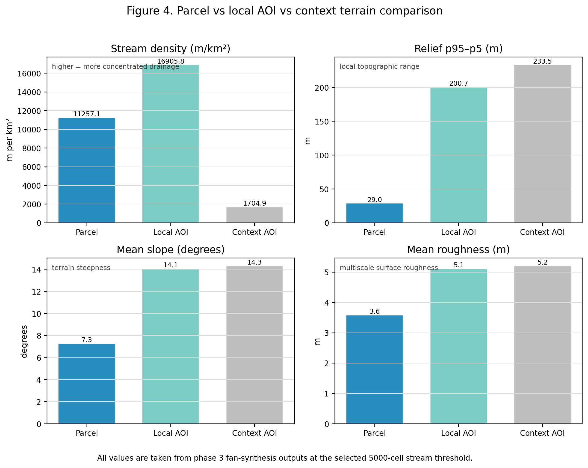
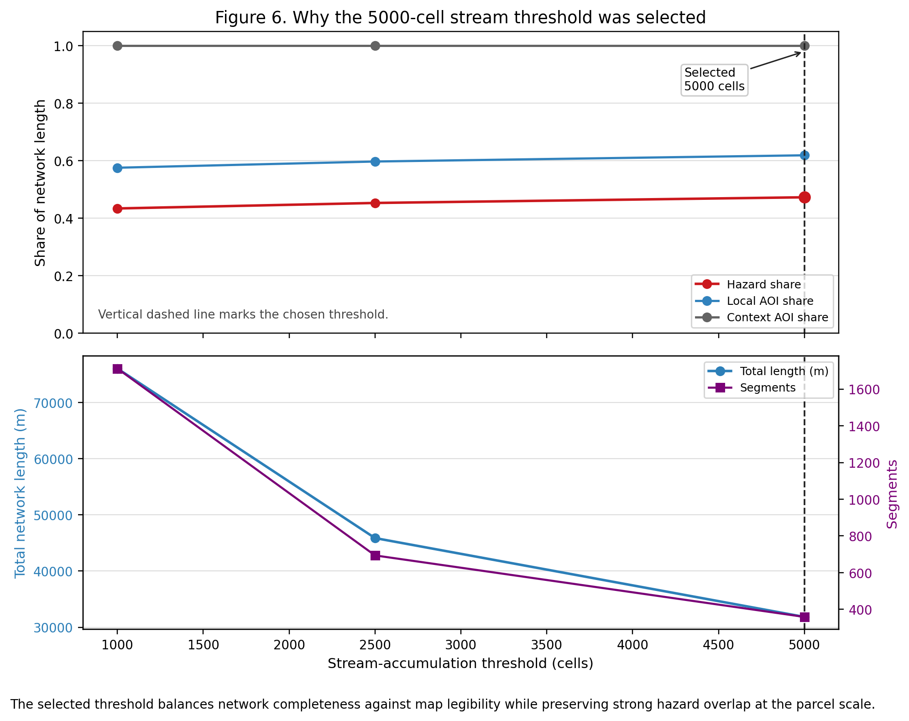

# Borrego Springs / De Anza Villas Flood Study

## Final report

Static figures: `../figures/final_report/`
Interactive supplements: `../maps/phase1_context.html`, `../maps/phase2_channel_context.html`, `../maps/phase3_parcel_context.html`, `../maps/phase3_fan_synthesis.html`, `../maps/phase4_satellite_validation.html`

### Executive summary

De Anza Villas is materially exposed to active concentrated-flow / alluvial-fan flood hazard on the Borrego Springs valley floor. That conclusion is supported by five independent lines of evidence that all point in the same direction: official flood-context mapping, a 1 m terrain reconstruction and wash extraction, an exact parcel overlay, fan-activity synthesis, and satellite wetting validation.

This report stays strictly within the evidence produced by phases 1–4. It does not invent calibrated flood depths, regulatory determinations, or new hydrodynamic model results.

### What this report is / is not

This is a private due-diligence synthesis, written to be direct and decision-oriented.

It is not:
- a FEMA map revision
- a licensed engineering flood study
- a calibrated inundation-depth model
- a claim that any particular channel is stable or protective in the future

### Bottom line

The terrain and mapped flood context indicate an active fan surface with concentrated drainage, and the authoritative parcel boundary intersects that drainage fabric. The selected extracted network remains strongly associated with mapped hazard polygons, and the satellite validation provides positive wetting evidence in the study area. The right conclusion for due diligence is that De Anza Villas should be treated as flood-exposed, not as a benign or marginal setting.

## Key findings

- The selected stream threshold is 5000 cells.
- At that threshold, the selected network totals 31,848.4 m across 359 segments.
- Of that network, 15,057.1 m overlaps mapped FEMA flood polygons, for a hazard share of 47.3%.
- The selected network within the parcel boundary totals 904.6 m.
- Of the parcel-crossing channel length, 96.7% overlaps mapped hazard polygons.
- Fan-synthesis metrics show the parcel still carries a dense drainage fabric and measurable relief/slope/roughness.
- HLS validation on 2023-08-22 shows positive local wetting evidence; the later S1 scene shows no local AOI water pixels and is treated only as weak absence evidence.

## Quantitative highlights

| Metric | Parcel | Local AOI | Context AOI |
|---|---:|---:|---:|
| Stream length (m) | 904.6 | 19,707.0 | 31,848.4 |
| Stream density (m/km²) | 11,257.1 | 16,905.8 | 1,704.9 |
| Relief p95–p5 (m) | 29.0 | 200.7 | 233.5 |
| Mean slope (degrees) | 7.3 | 14.1 | 14.3 |
| Mean roughness (m) | 3.6 | 5.1 | 5.2 |

## Evidence chain

### 1) Official flood-context framing

The terrain context review established the relevant flood setting: Borrego Springs is an alluvial-fan environment where flood water can concentrate in washes, redistribute across the fan, and change course. That context matters because apparent channels are not equivalent to stable, bank-confined streams.

The existing interactive context map remains available here:
- [Terrain context map](../maps/phase1_context.html)

### 2) 1 m terrain reconstruction and wash extraction

The terrain derivative set shows an active drainage texture rather than a flat, uniform surface. The selected 5000-cell threshold was used because it preserves the relevant concentrated-flow network while remaining legible enough for parcel-scale interpretation.

Key threshold-sweep result:
- 1000 cells: 76,026.9 m total length; 43.4% hazard share
- 2500 cells: 45,873.2 m total length; 45.3% hazard share
- 5000 cells: 31,848.4 m total length; 47.3% hazard share

The 5000-cell network remains strongly associated with hazard polygons while being materially simpler than the lower-threshold alternatives.

The existing interactive drainage map remains available here:
- [Wash extraction context map](../maps/phase2_channel_context.html)

### 3) Exact parcel overlay

Using the canonical parcel boundary, the selected network intersects the De Anza Villas complex boundary directly. The parcel-aware overlay found:

- 904.6 m of selected network inside the parcel boundary (2.8% of the total selected network length)
- 15,057.1 m of selected network inside mapped hazard polygons (47.3% hazard share)
- 875.2 m of selected network inside both parcel boundary and mapped hazard polygons
- 96.7% hazard overlap within the parcel-crossing channel length

That is not a fringe or isolated signal. It is a direct parcel-scale overlap between the authoritative property geometry and the extracted drainage fabric.

The existing interactive parcel overlay map remains available here:
- [Parcel overlay map](../maps/phase3_parcel_context.html)

### 4) Fan-activity synthesis

The fan-synthesis stage compares the parcel with a local AOI and a broader context AOI. The parcel still shows meaningful terrain complexity and concentrated drainage.

At the selected 5000-cell threshold:
- Parcel stream density: 11,257.1 m/km²
- Local AOI stream density: 16,905.8 m/km²
- Context AOI stream density: 1,704.9 m/km²
- Parcel mean slope: 7.3°
- Local AOI mean slope: 14.1°
- Context AOI mean slope: 14.3°

The correct reading is active fan drainage fabric with channel mobility, not a fixed, benign channel system.

The existing interactive fan synthesis map remains available here:
- [Fan synthesis map](../maps/phase3_fan_synthesis.html)

### 5) Satellite validation

The selected HLS scene dated 2023-08-22 provides positive local wetting evidence:
- local water pixels: 12
- parcel water pixels: 1
- overall water pixels: 73,516

The later S1 scene dated 2024-08-25 does not show local AOI water pixels. That is useful as a weak absence check, but it does not override the positive HLS wetting signal.

The existing interactive validation map remains available here:
- [Satellite validation map](../maps/phase4_satellite_validation.html)

## Figures

### Figure 1. Study area and flood-context overview

Static file: `../figures/final_report/figure1_context_overview.png`

This map orients the parcel in the official flood-context setting and shows the parcel boundary, parcel polygons, local AOI, context AOI, and FEMA flood polygons.

### Figure 2. Terrain and extracted drainage fabric

Static file: `../figures/final_report/figure2_terrain_drainage.png`

This figure shows the 1 m terrain texture together with the selected drainage network and mapped hazard polygons. It is the core terrain evidence for the active-fan interpretation.

### Figure 3. Parcel-scale channel / hazard overlap

Static file: `../figures/final_report/figure3_parcel_overlap.png`

This is the key parcel-scale map. It shows how the extracted network intersects the exact parcel geometry and where parcel-crossing channel length overlaps mapped hazard polygons.

### Figure 4. Quantitative terrain comparison

Static file: `../figures/final_report/figure4_terrain_comparison.png`

This chart compresses the terrain evidence into a simple parcel vs local AOI vs context comparison for stream density, relief, slope, and roughness.

### Figure 5. Satellite validation

Static file: `../figures/final_report/figure5_satellite_validation.png`

This figure pairs the selected 2023-08-22 OPERA DSWx-HLS browse image with the key pixel-count summary and the validation interpretation.

### Figure 6. Threshold justification

Static file: `../figures/final_report/figure6_threshold_justification.png`

This is the appendix / methods figure supporting the 5000-cell threshold choice.

## Recommendations

1. Treat the parcel as materially flood-exposed in due diligence.
2. Do not rely on apparent channel stability as proof of future stability.
3. If a lender, insurer, or permitting path requires more specificity, hand off to a licensed professional for site-specific design or regulatory work.
4. Keep the existing interactive maps as supplements, not substitutes, for the final report.

## Caveats and limits

- No calibrated flood depths were produced in this project.
- No new hydrodynamic model was run for the final report.
- No regulatory determination is being claimed here.
- The satellite validation is supportive, not dispositive; the S1 no-detection is weak absence evidence only.
- The report conclusions are bounded by the terrain, parcel, hazard, and satellite evidence actually produced.

## Source inventory

Primary source files used in the final synthesis:

- `README.md`
- `outputs/reports/new_session_handoff.md`
- `outputs/reports/phase2_wash_extraction.md`
- `outputs/reports/phase3_parcel_overlay.md`
- `outputs/reports/phase3_fan_synthesis.md`
- `outputs/reports/phase4_satellite_validation.md`
- `data/vectors/deanza_villas_complex_boundary.geojson`
- `data/vectors/deanza_villas_parcel_polygons.geojson`
- `data/vectors/deanza_villas_2km_aoi.geojson`
- `data/vectors/borrego_valley_context_8km_aoi.geojson`
- `data/raw/fema/oes_know_your_hazards_flooding_borrego.geojson`
- `data/processed/terrain/deanza_villas_2km_1m/deanza_villas_2km_1m_dem_filled.tif`
- `data/processed/terrain/deanza_villas_2km_1m/deanza_villas_2km_1m_dem_slope_degrees.tif`
- `data/processed/terrain/deanza_villas_2km_1m/deanza_villas_2km_1m_dem_d8_flow_accum.tif`
- `data/processed/terrain/deanza_villas_2km_1m/channels/deanza_villas_2km_1m_dem_filled_stream_threshold_sweep.csv`
- `data/processed/terrain/deanza_villas_2km_1m/channels/deanza_villas_2km_1m_dem_filled_streams_5000.gpkg`
- `data/processed/terrain/deanza_villas_2km_1m/parcels/phase3_parcel_overlay_metrics.csv`
- `data/processed/terrain/deanza_villas_2km_1m/fan_synthesis/phase3_fan_synthesis_stats.csv`
- `data/processed/terrain/deanza_villas_2km_1m/validation_phase4/phase4_satellite_validation_candidates.csv`
- `data/processed/terrain/deanza_villas_2km_1m/validation_phase4/phase4_satellite_validation_selected.json`

Derived deliverables:

- `outputs/figures/final_report/figure1_context_overview.png`
- `outputs/figures/final_report/figure2_terrain_drainage.png`
- `outputs/figures/final_report/figure3_parcel_overlap.png`
- `outputs/figures/final_report/figure4_terrain_comparison.png`
- `outputs/figures/final_report/figure5_satellite_validation.png`
- `outputs/figures/final_report/figure6_threshold_justification.png`
- `outputs/reports/final_report_plan.md`

## Canonical conclusion

The evidence produced by phases 1–4 supports a clear due-diligence conclusion: De Anza Villas is materially exposed to active concentrated-flow / alluvial-fan flood hazard, and apparent channel forms should not be treated as stable or protective.
